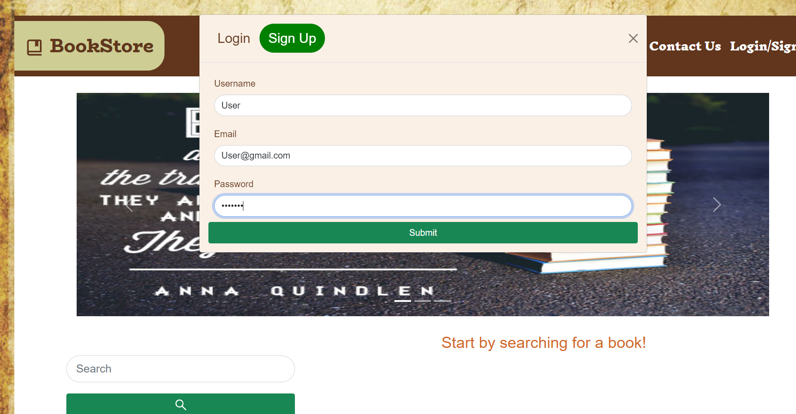
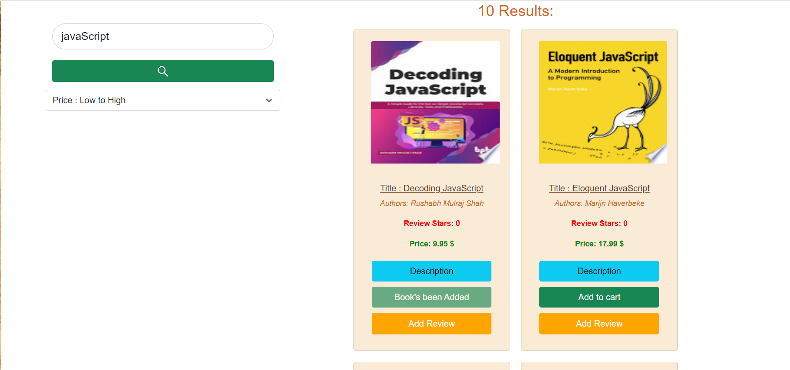
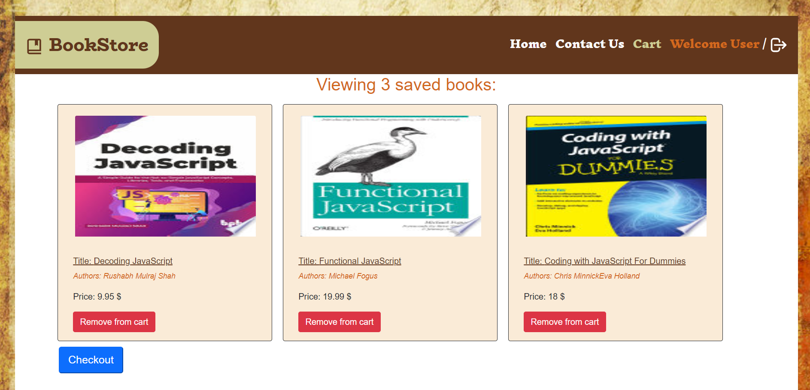

# book-store-app
# book-store-app

  ## Description:
A state-of-the-art online Book Store that allows registered users to search, sort by price, review, and add a favorite book from an extensive list of best sellers to The cart.

  ## User Story

```md
As an avid reader, I would like to browse popular books based on my reading preferences and have the option to sort books by price, add a review for a book, Adding the preferences books to the cart in order to buy it. 
```

  ## Table of Contents 
  - [Installation](#installation)
  - [Usage](#usage)
  - [License](#license)
  - [ScreenShot](#screenShot)
  - [Links](#links)
  - [Questions](#questions)
  - [Copyright](#copyright)

  ## Installation
  to install dependencies , run this following command :
``` 
 npm i
 ```
 
  ## Usage
The User needs to clone first the repo then install dependencies and runing the following command :

 ``` 
npm run build
 ```

 ``` 
npm run develop
 ```
  ## License
  This Project is licensed under **ISC** license.
  
  ## ScreenShot 

Login/Sing Up :
   

Search for books /Sing Up :
   

Add books to the Cart :
   


  ## Links

  * The URL of the GitHub repository : https://github.com/MERYEM-AD/book-store-app

  * The URL of the deployed application on Heroku :  [here](https://bookstoreapp2022.herokuapp.com/)
  
  ## Questions
  iF you have any questions about the repo you can contact The Team  :
  
  
* Email : adiri.meryem.mw@gmail.com  ||   [Meryem's Github Account](https://github.com/MERYEM-AD).

* Email : Zandrihunter@gmail.com ||  [Hunter's Account](https://github.com/Hunter-Zandri).

* Email : Nicholspduval74@gmail.com ||  [Nichols's Account](https://github.com/npduval).


  ## Copyright
 
```
Copyright 2021 , Meryem Adiri.

Permission to use, copy, modify, and/or distribute this software for any purpose with or without fee is hereby granted, provided that the above copyright notice and this permission notice appear in all copies.

THE SOFTWARE IS PROVIDED "AS IS" AND THE AUTHOR DISCLAIMS ALL WARRANTIES WITH REGARD TO THIS SOFTWARE INCLUDING ALL IMPLIED WARRANTIES OF MERCHANTABILITY AND FITNESS. IN NO EVENT SHALL THE AUTHOR BE LIABLE FOR ANY SPECIAL, DIRECT, INDIRECT, OR CONSEQUENTIAL DAMAGES OR ANY DAMAGES WHATSOEVER RESULTING FROM LOSS OF USE, DATA OR PROFITS, WHETHER IN AN ACTION OF CONTRACT, NEGLIGENCE OR OTHER TORTIOUS ACTION, ARISING OUT OF OR IN CONNECTION WITH THE USE OR PERFORMANCE OF THIS SOFTWARE.

```

