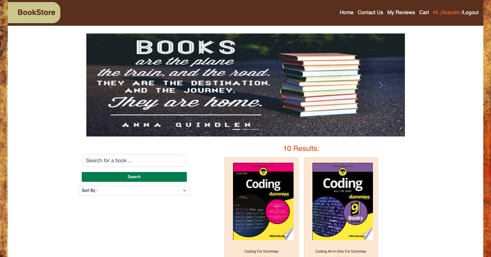

#book-store-app
[](https://opensource.org/licenses/AFL-3.0)

## Description
A state of the art Book Store which allows registered users to search, review, and save their favorite books. 

## Table of Contents
* [Installation](#installation)
* [Usage](#usage)
* [Contribution](#contribution)
* [License](#license)
* [Questions](#questions)

## Installation
After cloning the repo, users should run:
```bash
npm  i
```
Followed by:
```bash
npm run develop
```
This will start both the client and server to run locally. The client will be available at: http://localhost:3000/ and the server GraphQL playground will be available at: http://localhost:3001/graphql

## Usage
When clicking onto our page you’ll be greeted by our homepage where you’re able to search books, view the price, and learn about the book by clicking on the about page.  On the main page you’ll see a login/signup link, when clicked it’ll present a dropdown menu which will allow new users to  signup and existing users to login back into to their account. When you sign in you’ll be allowed to save books to your cart, add reviews and look at other peoples reviews.


User Flow Diagram:


Deployed Application: https://bookstoreapp2022.herokuapp.com/ 

## Contribution
Open

## License 
Licensed under the Academic License. Copyright © 2022

## Questions
*For any additional questions, please contact the group using one of these methods: at:* 

Hunter Zandri : GitHub: [@hunter-zandri](https://github.com/hunter-zandri), Email: [zandirhunter@gmail.com](mailto:zandrihunter@gmail.com)

Meryem Mery: GitHub: [@](), Email: [](mailto:)

Nick Duval: GitHub: [@](), Email: [](mailto:)